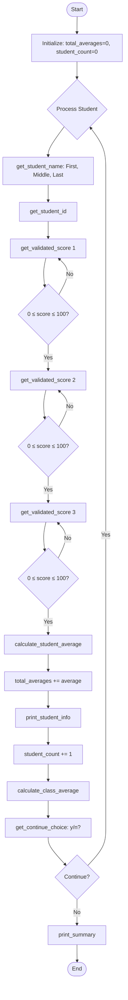

# Student Grade Calculator - Program Flow Diagram

## High-Level Module Structure

```
┌─────────────────────────────────────────────────────────────────┐
│                         main.py                                  │
│                    (Orchestrates the flow)                       │
└───────────────┬─────────────────┬─────────────────┬────────────┘
                │                 │                 │
                ▼                 ▼                 ▼
        ┌───────────────┐ ┌───────────────┐ ┌───────────────┐
        │ input_utils   │ │ calculations  │ │   display     │
        │               │ │               │ │               │
        │ • get_student_ │ │ • calculate_  │ │ • print_      │
        │   name()      │ │   student_    │ │   student_    │
        │ • get_student_│ │   average()   │ │   info()      │
        │   id()        │ │ • calculate_  │ │ • print_      │
        │ • get_validated│ │   class_      │ │   summary()   │
        │   _score()    │ │   average()   │ │               │
        │ • get_continue│ │               │ │               │
        │   _choice()   │ │               │ │               │
        └───────────────┘ └───────────────┘ └───────────────┘
```

## Detailed Program Flow (Mermaid)



## Data Flow Between Modules

| Step | Module        | Function                 | Input                    | Output                    |
|------|---------------|--------------------------|--------------------------|---------------------------|
| 1    | input_utils   | get_student_name()       | (user input)             | first_name, middle, last  |
| 2    | input_utils   | get_student_id()         | (user input)             | student_id                |
| 3    | input_utils   | get_validated_score(n)   | prompt number            | score (0-100)             |
| 4    | calculations  | calculate_student_average| score1, score2, score3   | total, average            |
| 5    | display       | print_student_info()     | all student data         | (prints to console)       |
| 6    | calculations  | calculate_class_average  | total_averages, count    | class_average             |
| 7    | input_utils   | get_continue_choice()    | (user input)             | True/False                |
| 8    | display       | print_summary()          | count, class_average     | (prints to console)       |
