# Student Grade Calculator

[Python 3.7+](https://www.python.org/downloads/)
[License: MIT](https://opensource.org/licenses/MIT)

A command-line Python application that computes the average of three test scores per student and the overall class average for one or more students in a single session.

## Project Description

### What It Does

The **Student Grade Calculator** is a modular command-line application that:

- Prompts for student information (first name, middle initial, last name, student ID)
- Accepts three test scores per student with validation (0–100 range)
- Calculates each student's average and displays their information
- Tracks the class average across all entered students
- Allows processing multiple students in a single session via a continue prompt
- Prints a final summary with total student count and class average

### Technology Choices

- **Python 3.7+**
- **Standard library only**: No external dependencies—keeps the project lightweight and easy to run anywhere Python is installed.

### Challenges Solved

- **Input validation**: Scores are validated to ensure they fall within 0–100; invalid input triggers re-prompting.
- **Clean architecture**: The original Java program (CSC-117) was refactored into focused modules instead of a single monolithic script.
- **Robust middle initial handling**: Handles empty or multi-character input by taking only the first character.
- **Division by zero**: Class average returns 0.0 when no students have been entered.

---

## Installation

### Prerequisites

- **Python 3.7 or higher**

Check your Python version:

```bash
python --version
# or
python3 --version
```

### Step-by-Step Setup

1. **Clone or download** the repository:
  ```bash
   git clone <repository-url>
   cd student-grade-calculator
  ```
2. **No external dependencies** are required. The project uses only the Python standard library.
3. **Optional but recommended**: Create and activate a virtual environment:
  ```bash
   python -m venv venv
   # Windows
   venv\Scripts\activate
   # macOS/Linux
   source venv/bin/activate
  ```

### Required Dependencies


| Dependency | Version | Notes                                          |
| ---------- | ------- | ---------------------------------------------- |
| Python     | 3.7+    | Standard library only; no `pip install` needed |


---

## Usage

### Running the Application

From the project directory, run:

```bash
python main.py
```

or:

```bash
python3 main.py
```

### Example Session

```
Please enter student's first name: John
Please enter student's middle initial: A
Please enter student's last name: Smith
Please enter student's ID Number: 12345
Please enter student's score1: 85
Please enter student's score2: 92
Please enter student's score3: 78
Student's First Name= John
Student's Middle Initial= A
Student's Last Name= Smith
Student's ID Number= 12345
Student's Test Score1= 85.00
Student's Test Score2= 92.00
Student's Test Score3= 78.00
Student's Average= 85.00

 ************************
Do you want to continue: (y/n): n
Total Number of students: 1
Class Average= 85.00
```

### Input Rules

- **Scores**: Must be between 0 and 100 (inclusive). Invalid scores trigger a re-prompt.
- **Continue**: Enter `y` or `Y` to add another student; any other input (e.g., `n`) exits and shows the summary.
- **Student ID**: Must be a valid integer; non-numeric input will raise an error.

---

## Project Structure

```
student-grade-calculator/
├── main.py                 # Entry point; orchestrates the program flow
├── modules/                # Package containing modular helper programs
│   ├── input_utils.py      # Input handling (names, ID, scores, continue choice)
│   ├── calculations.py     # Student and class average computations
│   └── display.py          # Output formatting and printing
├── .gitignore              # Git ignore rules
└── README.md               # This file
```

---

## Diagrams

**High-Level Module Structure**

```
┌─────────────────────────────────────────────────────────────────┐
│                         main.py                                  │
│                    (Orchestrates the flow)                       │
└───────────────┬─────────────────┬─────────────────┬────────────┘
                │                 │                 │
                ▼                 ▼                 ▼
        ┌───────────────┐ ┌───────────────┐ ┌───────────────┐
        │ input_utils   │ │ calculations  │ │   display     │
        │               │ │               │ │               │
        │ • get_student_ │ │ • calculate_  │ │ • print_      │
        │   name()      │ │   student_    │ │   student_    │
        │ • get_student_│ │   average()   │ │   info()      │
        │   id()        │ │ • calculate_  │ │ • print_      │
        │ • get_validated│ │   class_      │ │   summary()   │
        │   _score()    │ │   average()   │ │               │
        │ • get_continue│ │               │ │               │
        │   _choice()   │ │               │ │               │
        └───────────────┘ └───────────────┘ └───────────────┘
```

**Detailed Program Flow (Mermaid)**

```mermaid
flowchart LR
    Start([Start]) --> Init[Initialize: total_averages=0, student_count=0]
    Init --> LoopStart{Process Student}
    
    LoopStart --> GetName[get_student_name: First, Middle, Last]
    GetName --> GetID[get_student_id]
    GetID --> GetScore1[get_validated_score 1]
    GetScore1 --> Validate1{0 ≤ score ≤ 100?}
    Validate1 -->|No| GetScore1
    Validate1 -->|Yes| GetScore2[get_validated_score 2]
    GetScore2 --> Validate2{0 ≤ score ≤ 100?}
    Validate2 -->|No| GetScore2
    Validate2 -->|Yes| GetScore3[get_validated_score 3]
    GetScore3 --> Validate3{0 ≤ score ≤ 100?}
    Validate3 -->|No| GetScore3
    Validate3 -->|Yes| Calc[calculate_student_average]
    
    Calc --> AddTotal[total_averages += average]
    AddTotal --> PrintInfo[print_student_info]
    PrintInfo --> IncCount[student_count += 1]
    IncCount --> CalcClass[calculate_class_average]
    CalcClass --> AskContinue[get_continue_choice: y/n?]
    
    AskContinue --> Continue{Continue?}
    Continue -->|Yes| LoopStart
    Continue -->|No| PrintSummary[print_summary]
    PrintSummary --> End([End])
```



### Data Flow Between Modules

| Step | Module                | Function                  | Input                  | Output                   |
|------|-----------------------|---------------------------|------------------------|--------------------------|
| 1    | `modules.input_utils` | `get_student_name()`      | (user input)           | first_name, middle, last |
| 2    | `modules.input_utils` | `get_student_id()`        | (user input)           | student_id               |
| 3    | `modules.input_utils` | `get_validated_score(n)`  | prompt number          | score (0–100)            |
| 4    | `modules.calculations`| `calculate_student_average` | score1, score2, score3 | total, average           |
| 5    | `modules.display`     | `print_student_info()`    | all student data       | (prints to console)      |
| 6    | `modules.calculations`| `calculate_class_average` | total_averages, count  | class_average            |
| 7    | `modules.input_utils` | `get_continue_choice()`   | (user input)           | True/False               |
| 8    | `modules.display`     | `print_summary()`         | count, class_average   | (prints to console)      |


## Contributing

Contributions are welcome. To contribute:

1. **Fork** the repository.
2. **Create a branch** for your feature or fix:
  ```bash
   git checkout -b feature/your-feature-name
  ```
3. **Make your changes** and ensure code follows existing style (type hints, docstrings).
4. **Add or update tests** if applicable.
5. **Submit a pull request** with a clear description of your changes.

---

## Credits

- **Author**: Hamza Siyam

---

## Statement of AI Use

I use generative AI to accelerate my coding, but strictly maintain a "human in the loop" to ensure accountability and accuracy. Because AI is not a substitute for foundational programming knowledge and can produce confident errors (hallucinations), I actively apply my expertise to debug and refine all automated suggestions.

I am also highly vigilant against AI bias, recognizing that machine learning models can easily absorb and amplify historical inequalities. To build fair applications, I critically evaluate my algorithms and avoid flawed proxies—*using an easily measurable but misleading metric to represent a complex reality, much like using a person's zip code to judge their financial reliability*. By recognizing these limitations, I ensure incomplete data does not unfairly penalize vulnerable groups. Ultimately, the responsibility for the code rests entirely with me.

*This statement was informed by the [Certificate in Artificial Intelligence and Career Empowerment](https://www.rhsmith.umd.edu/programs/executive-education/learning-opportunities-individuals/free-online-certificate-artificial-intelligence-and-career-empowerment) from the University of Maryland Robert H. Smith School of Business. See [References & Acknowledgements](#references--acknowledgements) for the full resource link.*

---

## License

This project is licensed under the **MIT License**.

---

## References & Acknowledgements

- **Statement of AI Use informed by**: [Certificate in Artificial Intelligence and Career Empowerment](https://www.rhsmith.umd.edu/programs/executive-education/learning-opportunities-individuals/free-online-certificate-artificial-intelligence-and-career-empowerment), University of Maryland Robert H. Smith School of Business.
- **Code commenting methodology informed by**: [AI Programming with Python – Commenting in Python](https://www.udacity.com/course/ai-programming-python-nanodegree--nd089), Udacity. Used as the guide for docstrings, single-line comments, and in-code documentation in this repository.
- *This README was structured based on the principles outlined in [How to Write a Good README File for Your GitHub Project](https://www.freecodecamp.org/news/how-to-write-a-good-readme-file/) by freeCodeCamp.*

