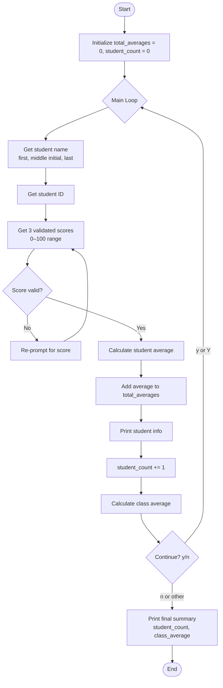

# Student Grade Calculator — Program Flow

Describes the control flow of the application from start to finish, including the main loop and decision points.

```mermaid
flowchart TD
    Start([Start]) --> Init[Initialize total_averages = 0, student_count = 0]
    Init --> Loop{Main Loop}
    
    Loop --> GetName[Get student name\nfirst, middle initial, last]
    GetName --> GetID[Get student ID]
    GetID --> GetScores[Get 3 validated scores\n0–100 range]
    
    GetScores --> ValidateScore{Score valid?}
    ValidateScore -->|No| RePrompt[Re-prompt for score]
    RePrompt --> GetScores
    ValidateScore -->|Yes| CalcStudent[Calculate student average]
    
    CalcStudent --> UpdateTotal[Add average to total_averages]
    UpdateTotal --> PrintStudent[Print student info]
    PrintStudent --> IncrementCount[student_count += 1]
    IncrementCount --> CalcClass[Calculate class average]
    CalcClass --> AskContinue{Continue? y/n}
    
    AskContinue -->|y or Y| Loop
    AskContinue -->|n or other| PrintSummary[Print final summary\nstudent_count, class_average]
    PrintSummary --> End([End])
```
